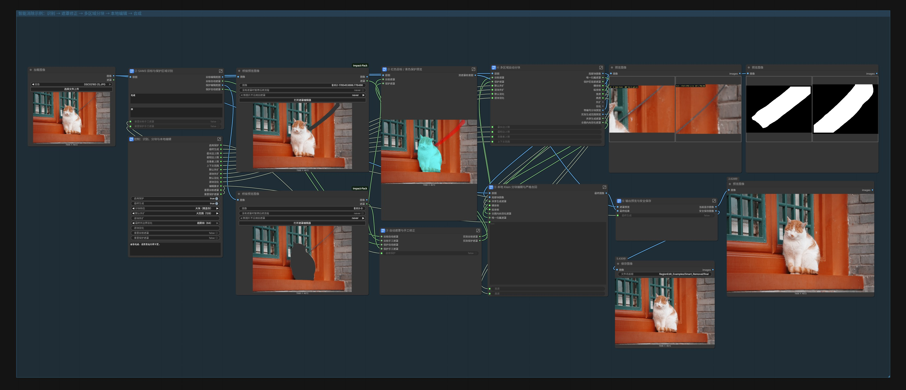
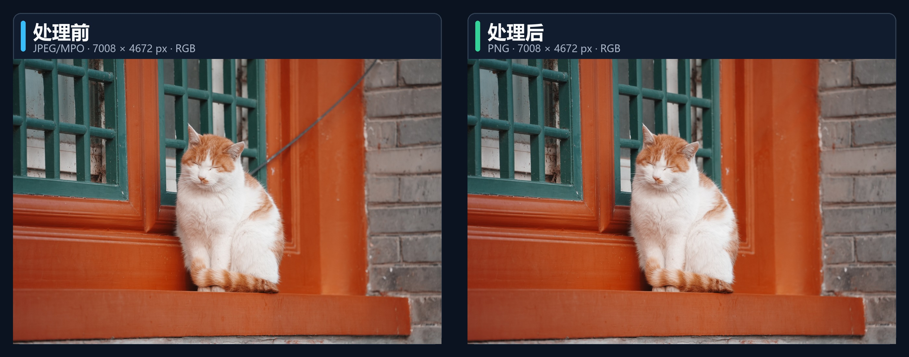
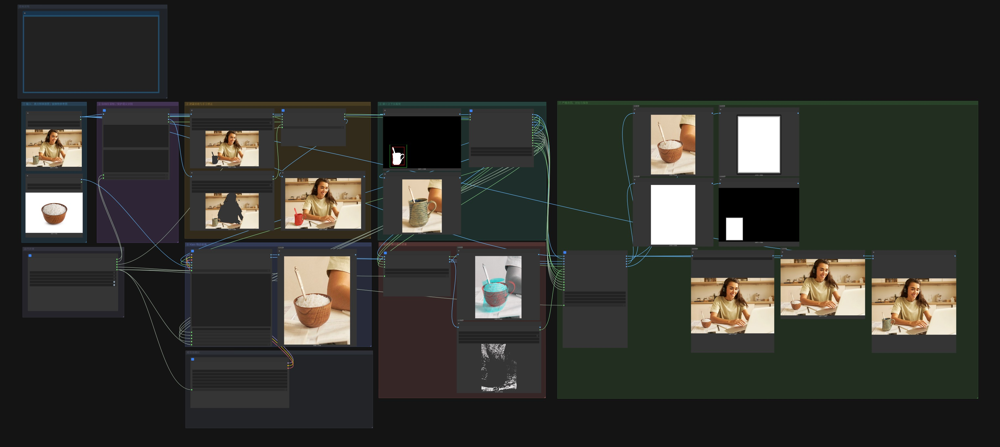

# ComfyUI 图像分区编辑工具包

**Region Edit Toolkit** 为 ComfyUI 提供一组可组合的图像分区处理节点，覆盖区域定位、裁切、遮罩编辑、分块处理、颜色与细节协调，以及局部结果的精确回贴。

当前版本包含 42 个 `RegionEdit...` 节点，统一位于 `Region Edit Toolkit` 菜单下。

## 功能

- 从人脸、检测框或扫描窗口建立处理区域
- 组合自动遮罩、手涂修正和保护遮罩
- 为大图或多个离散目标规划并合并分块
- 按原始坐标将局部处理结果精确合回原图
- 匹配局部颜色、低频、高频和皮肤微纹理
- 构建并检查局部编辑 Prompt
- 可选使用本地 Argos 模型完成中文到英文的离线翻译

## 安装

需要 Python 3.10 或更高版本。依赖必须安装到 ComfyUI 实际使用的 Python 环境中。

### 使用 ComfyUI Manager（推荐）

本节点已发布到 [ComfyUI Registry](https://registry.comfy.org/nodes/native-region-tile-planner-merge)。

#### 通过示例工作流安装缺失节点包

1. [下载智能消除示例工作流 JSON](https://raw.githubusercontent.com/Liu-Bot24/ComfyUI-Region-Edit-Toolkit/main/workflows/examples/RegionEdit-Smart-Removal-Example.json)，或[下载物品替换示例工作流 JSON](https://raw.githubusercontent.com/Liu-Bot24/ComfyUI-Region-Edit-Toolkit/main/workflows/examples/RegionEdit-Object-Replacement-Example.json)。
2. 将 JSON 文件拖入 ComfyUI 画布，或通过“工作流 → 打开”加载。
3. 打开 ComfyUI Manager 的“缺失节点”（`Install Missing Custom Nodes`）页面。
4. 安装列表中的 `Region Edit Toolkit`（包 ID：`native-region-tile-planner-merge`）及工作流需要的其他节点包，然后重启 ComfyUI。
5. 重新加载工作流，替换示例图片，并按本机目录选择所需模型。

#### 在 Manager 中直接搜索安装

1. 打开 ComfyUI Manager 的自定义节点管理器。
2. 搜索 `Region Edit Toolkit` 或 `native-region-tile-planner-merge`。
3. 点击安装，完成后重启 ComfyUI。

### 使用 Comfy CLI

```powershell
comfy node install native-region-tile-planner-merge
```

### 使用 Git

在 PowerShell 中进入 `ComfyUI\custom_nodes`，执行：

```powershell
git clone https://github.com/Liu-Bot24/ComfyUI-Region-Edit-Toolkit.git
Set-Location .\ComfyUI-Region-Edit-Toolkit
& "<ComfyUI 实际使用的 Python>" -m pip install -r requirements.txt
```

常见的 Python 路径：

- Windows 便携版：`ComfyUI_windows_portable\python_embeded\python.exe`
- Python 虚拟环境：`ComfyUI\venv\Scripts\python.exe`
- 启动器整合包：以启动器实际配置的 Python 路径为准

安装完成后重启 ComfyUI。在节点搜索中输入 `图像分区` 或 `RegionEdit` 即可找到本工具包。

### 更新

```powershell
Set-Location "<ComfyUI>\custom_nodes\ComfyUI-Region-Edit-Toolkit"
git pull
& "<ComfyUI 实际使用的 Python>" -m pip install -r requirements.txt
```

更新后需要重启 ComfyUI。若界面仍保留旧控件，再硬刷新浏览器页面。

## 快速使用

### 局部编辑

```text
选择区域
→ 规划尺寸并裁切
→ 使用图像编辑或生成节点处理裁块
→ 处理差异、颜色或细节
→ 严格坐标合成
```

局部结果进入严格合成前，应与原裁块保持相同的宽高和坐标空间。

### 手涂修正遮罩

```text
自动遮罩
→ RegionEditMaskEditorCanvas
→ PreviewBridge
→ 在 MaskEditor 中补画或擦除
→ RegionEditMaskEditorApply
→ 羽化或合成
```

连接方法：

1. 将 `RegionEditMaskEditorCanvas` 的 `mask_editor_rgba` 接到 `PreviewBridge`。
2. 在 `PreviewBridge` 中打开 MaskEditor，完成补画或擦除并保存。
3. 将 `PreviewBridge` 的 `MASK` 接到 `RegionEditMaskEditorApply` 的 `edited_mask`。

这条交互式手涂路径需要 [ComfyUI Impact Pack](https://github.com/ltdrdata/ComfyUI-Impact-Pack) 提供 `PreviewBridge`。

### 大图多区域处理

```text
目标遮罩
→ RegionEditTilePlanner
→ RegionEditTileBatchPrepare
→ 分别处理各个局部块
→ RegionEditTileMerge
```

该流程适合原图较大、目标分散或单次模型输入尺寸受限的情况。

## 示例工作流

### 智能消除

**[示例工作流：智能消除.json](workflows/examples/RegionEdit-Smart-Removal-Example.json)**

该示例演示 SAM3 目标与保护区域识别、手工遮罩修正、多区域分块、本地 Klein 编辑、严格合成，以及只保存最终生成结果的安全输出链。



#### 效果对比



<p align="center"><sub>移除目标电线，保留猫和其余场景，并保持原图分辨率。</sub></p>

### 物品替换

**[示例工作流：物品替换.json](workflows/examples/RegionEdit-Object-Replacement-Example.json)**

该示例演示 SAM3 目标与可选保护区域识别、手工遮罩修正、单一上下文裁块、参考图引导的本地 Klein 编辑、差异遮罩、严格合成，以及最终结果保存。



#### 效果对比


<p align="center"><sub>将桌面上的咖啡杯替换为一碗米饭，保留勺子和其余场景，并保持原图分辨率。</sub></p>

导入后，可替换示例图片，并按本机模型目录选择 SAM3 与 Klein 模型即可运行。

## 节点

### Selection

| 节点 | 用途 |
|---|---|
| `RegionEditFaceSelect` | 从人脸检测结果中选择指定人脸 |
| `RegionEditDetectionsToRegionCrops` | 将检测框转换为区域裁块与坐标 |
| `RegionEditImageGridWindows` | 按网格生成图像扫描窗口 |

### Geometry

| 节点 | 用途 |
|---|---|
| `RegionEditBoundedImageSizePlan` | 在指定像素范围内规划等比处理尺寸 |
| `RegionEditExactIntegerDownscale` | 执行 16 对齐的整数倍缩小 |
| `RegionEditFaceContextCrop` | 裁取包含周围上下文的人脸区域 |
| `RegionEditTilePlanItem` | 读取分块计划中的指定项目 |

### Mask

| 节点 | 用途 |
|---|---|
| `RegionEditMaskSetCompose` | 合成一组处理遮罩 |
| `RegionEditInteractiveMaskCompose` | 组合自动、手工与保护遮罩 |
| `RegionEditAlignedDifferenceMask` | 从两张已对齐图像中提取差异遮罩 |
| `RegionEditMaskEditorCanvas` | 生成供 MaskEditor 使用的手涂画布 |
| `RegionEditMaskEditorApply` | 将手工编辑结果应用到自动遮罩 |
| `RegionEditMaskContentGate` | 检查遮罩是否包含有效处理区域 |
| `RegionEditBoundaryFeather4Side` | 分别控制裁块四条边的羽化宽度 |
| `RegionEditProtectedOuterBoundaryFeather` | 羽化外围边界并保护核心区域 |

### Face

| 节点 | 用途 |
|---|---|
| `RegionEditFaceAdaptiveDifferenceMask` | 生成人脸自适应差异区与强制核心 |
| `RegionEditFaceThresholdDifferenceMask` | 按阈值生成人脸差异区与强制核心 |
| `RegionEditFaceIdentityConditioningMask` | 生成人脸身份参考遮罩 |
| `RegionEditFaceEyeMaterialRestore` | 恢复或协调眼部内部材质 |
| `RegionEditFaceStructureDelta` | 分析两张人脸之间的结构变化 |
| `RegionEditFaceSemanticCrop` | 按人脸语义区域生成局部裁块 |

### Tile

| 节点 | 用途 |
|---|---|
| `RegionEditTilePlanner` | 根据目标遮罩规划多个处理块 |
| `RegionEditBasicTileBatchPrepare` | 批量裁取计划中的图像和遮罩 |
| `RegionEditTileBatchPrepare` | 按控制参数准备局部块、遮罩和坐标 |
| `RegionEditTileMerge` | 将多个局部结果归一化后合回完整图像 |
| `RegionEditWindowMaskMerge` | 将扫描窗口中的局部遮罩恢复到整图 |

### Workflow

| 节点 | 用途 |
|---|---|
| `RegionEditTileControlPreset` | 提供成组的分块控制参数 |
| `RegionEditReferenceSourceSelector` | 选择实际使用的参考图来源 |
| `RegionEditPromptRouteSelector` | 选择实际使用的 Prompt 来源 |

### Composite

| 节点 | 用途 |
|---|---|
| `RegionEditStrictCoordinateComposite` | 按坐标和遮罩将局部结果严格合回原图 |
| `RegionEditWideSupportStrictComposite` | 在更宽的支持区域内执行严格坐标合成 |

### Color & Detail

| 节点 | 用途 |
|---|---|
| `RegionEditMaskedGlobalLabMatch` | 匹配遮罩区域内的整体 Lab 颜色 |
| `RegionEditMaskedSpatialColorFieldMatch` | 匹配随空间变化的低频颜色分布 |
| `RegionEditMaskedHighFrequencyTransfer` | 在限定区域内迁移高频纹理 |
| `RegionEditSkinMicrotextureSynthesis` | 在皮肤区域生成受控微纹理 |
| `RegionEditProtectedDetailHarmonizer` | 在保护指定区域的同时协调局部细节 |

### Text

| 节点 | 用途 |
|---|---|
| `RegionEditFacePromptContract` | 整理人脸编辑 Prompt |
| `RegionEditPortraitPromptQualityGate` | 检查人像 Prompt 的必要信息 |
| `RegionEditReplacementPromptContract` | 整理局部替换 Prompt |
| `RegionEditPreservationPromptBuilder` | 构建需要保持不变的编辑约束 |
| `RegionEditRequiredOfflineEnglish` | 对必填文本执行离线中译英 |
| `RegionEditOptionalOfflineEnglish` | 对可选文本执行离线中译英 |

## 离线中译英

`requirements.txt` 会安装 Argos Translate，但中文到英文的语言模型需要单独安装。

检查本机是否已经安装 `zh → en` 模型：

```powershell
& "<ComfyUI 实际使用的 Python>" scripts\install_argos_zh_en.py --check
```

主动下载并安装：

```powershell
& "<ComfyUI 实际使用的 Python>" scripts\install_argos_zh_en.py
```

安装完成后重启 ComfyUI。不使用离线翻译节点时，无需安装该语言模型。

## 使用注意事项

- 差异分析和严格合成所使用的图像、遮罩、裁块尺寸与坐标必须对应。
- 外部编辑结果如果改变了宽高或裁切范围，应先恢复到原裁块尺寸。
- 尺寸或坐标不一致时，严格合成节点会停止执行并给出明确错误。
- 需要保持不变的区域应通过保护遮罩明确指定。
- Python 节点或前端扩展更新后，必须重启 ComfyUI。
